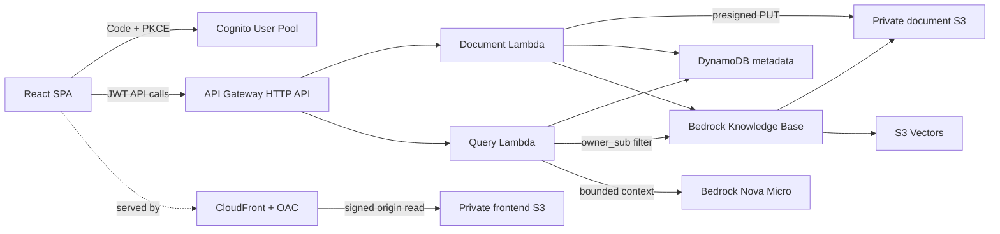
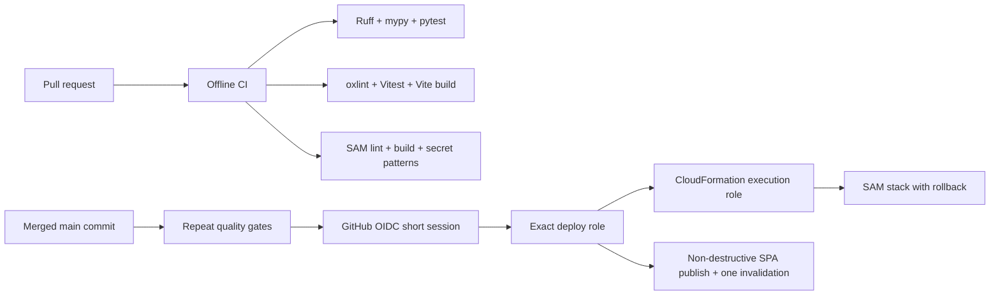

# AWS Document RAG

An owner-isolated retrieval-augmented generation (RAG) application on AWS. Authenticated users upload small private TXT, Markdown, or PDF documents, wait for indexing, and ask questions whose answers are grounded in their own retrieved content with citations.

[Open the hosted application](https://d39nib2ha1lp5v.cloudfront.net/) · [Demo runbook](docs/demo.md) · [Architecture details](docs/architecture/overview.md)

## User flow

1. Sign in through Cognito using Authorization Code + PKCE.
2. Request a five-minute presigned URL and upload directly to private S3.
3. Finalize the upload and start a bounded Knowledge Base ingestion job.
4. Poll until the document is `READY`.
5. Ask a question across all documents or one selected document.
6. See a bounded Nova Micro answer and citations to the retrieved owner-matching documents.

The browser never supplies an owner ID. Every protected operation derives ownership from the verified Cognito JWT `sub`.

## Runtime architecture



Why each service exists:

- **Cognito** handles user identity and standards-based SPA login without a client secret.
- **API Gateway** verifies JWTs, applies CORS and throttling, and exposes a small HTTP boundary.
- **Lambda** keeps document and query workloads event-driven with no idle server.
- **S3** stores private source documents and static frontend artifacts; presigned PUT keeps document bytes out of Lambda.
- **DynamoDB** stores authoritative document lifecycle/ownership and the atomic monthly generation counter.
- **Bedrock Knowledge Bases** manages chunking, embeddings, ingestion, retrieval, and source attribution.
- **S3 Vectors** stores/query embeddings without a provisioned OpenSearch collection.
- **Nova Micro** generates one bounded response from retrieved context.
- **CloudFront with OAC** serves the SPA over HTTPS while the origin bucket remains private.

## RAG and isolation lifecycle

The document state machine is `PENDING_UPLOAD -> UPLOADED -> INGESTING -> READY`, with sanitized `FAILED` reconciliation. Finalization writes a sidecar containing the server-owned `owner_sub` and `document_id`. Retrieval always includes an exact `owner_sub` metadata filter; selecting one document adds a second narrowing filter. The query Lambda discards any result whose metadata does not match before building context.

Retrieved text is treated as untrusted data, serialized below a system instruction, and bounded to five chunks of 2,000 characters. Questions are limited to 1,000 characters and generation to 256 output tokens with one model attempt. Zero retrieval results skip generation.

## Security, reliability, and cost boundaries

- Private encrypted S3 buckets with Block Public Access; CloudFront alone can read the frontend origin through an exact distribution policy.
- Default JWT authorizer on every API route; owner keys and filters are server-derived.
- Exact application IAM operations/resources, content-free structured logs, and 14-day log retention.
- Five-minute uploads, 100 KiB/document, 20 documents/user, API rate 5/s with burst 10.
- Atomic ceiling of 100 generation calls/month; expected bounded portfolio usage is roughly below $0.25/month, excluding taxes, unusual traffic, account-wide usage, and pricing changes.
- No WAF, custom domain, multi-Region replication, reranker, advanced parser, or provisioned vector/search capacity.

See the [security and cost audit](docs/plan/PHASE_08_AUDIT.md) and [hosting gate](docs/plan/GATE_D_REPORT.md).

## CI/CD architecture



PR CI never receives AWS credentials. A push to `main` must pass the same gates before a short OIDC session can assume a role bound to the immutable repository identity and exact branch. The GitHub role, CloudFormation execution role, and runtime roles are separate. Deployments do not upload documents, ingest content, retrieve, or invoke a model. The first complete automatic deployment is recorded in [Gate E](docs/plan/GATE_E_REPORT.md).

## Local development

Requirements: Python 3.13, [uv](https://docs.astral.sh/uv/), Node.js 24, AWS SAM CLI, and npm.

```powershell
uv sync --locked --all-groups
uv run ruff format --check .
uv run ruff check .
uv run mypy
uv run pytest
sam validate --lint
sam build

Set-Location frontend
npm ci
npm run lint
npm test -- --run
npm run build
npm run dev
```

Copy `frontend/.env.example` to the ignored `frontend/.env.local` and fill only the public stack outputs to use real Cognito/API services. With no Cognito configuration, the explicitly injectable mock adapters support credential-free local UI development and tests; they are not in the configured production path. See [local development](docs/development.md).

## Deployment and operations

- [Manual deployment and rollback](docs/manual-deployment.md)
- [GitHub OIDC CI/CD](docs/cicd.md)
- [Repeatable demo](docs/demo.md)
- [Interview explanations](docs/interview-guide.md)
- [Final verification](docs/plan/PHASE_11_AUDIT.md)

Infrastructure is defined in `template.yaml`; deployment bootstrap access is defined separately in `infrastructure/deployment-access.yaml`. Teardown is intentionally manual because buckets, user identities, metadata, vectors, and source documents are data-bearing resources.

## Limitations and sensible next steps

This is a bounded portfolio environment, not a production compliance claim. It supports tiny files, one Region, a generated CloudFront URL, simple fixed-size chunking, polling, and a development budget counter. Production evolution would add explicit data retention/deletion, malware/content scanning, alarms and budget notifications, WAF/abuse controls, custom-domain certificates, accessibility and browser automation, richer parsing, evaluation datasets, and infrastructure drift/recovery exercises—each behind a reviewed cost and security decision.
